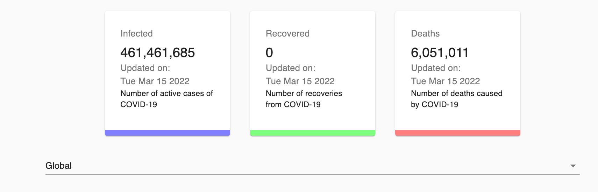
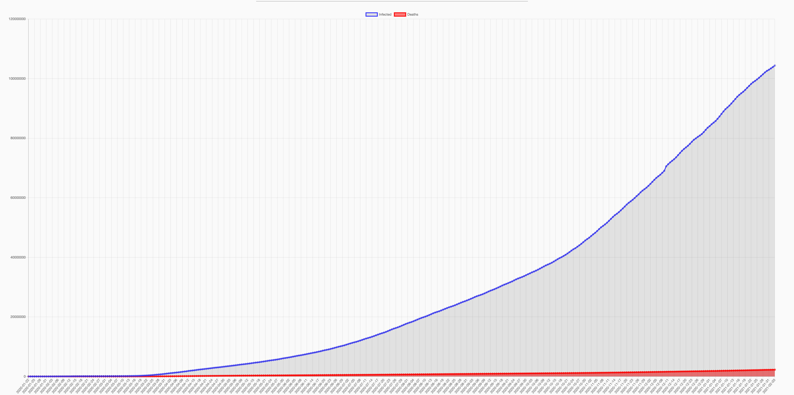

The Covid19 Tracker App runs the Johns Hopkins API (https://covid19.mathdro.id/api) to track live real world data of Covid19 cases for every country across the world.
This App makes use of a graphical user interface to view the data easily that was parsed from JSON.

# Getting Started with Running this React App

This project runs on localhost:3000
You have to navigate to the project folder and run the commands successfully

## Available Scripts
In the project directory, you can run:

### `npm install` this will install the nodel modules needed to run the application

### `npm audit fix` this command may not be neccesary unless you get a warning or errors

### `npm audit fix --force` this command may be needed to force the repairs

### `npm run start` will run the program on localhost:3000

